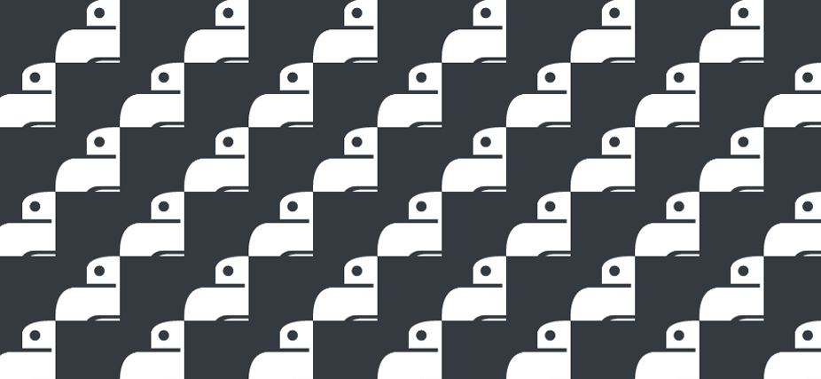

# Python Interview Preparation

#### -- Project Status: [Active]

## Objective
Test the ability to manipulate simple data structures and to implement algorithmic concepts.

### Sources
* Most of the questions come from the book [Ace the Data Science Interview](https://www.acethedatascienceinterview.com/).

### Technologies
* Python
